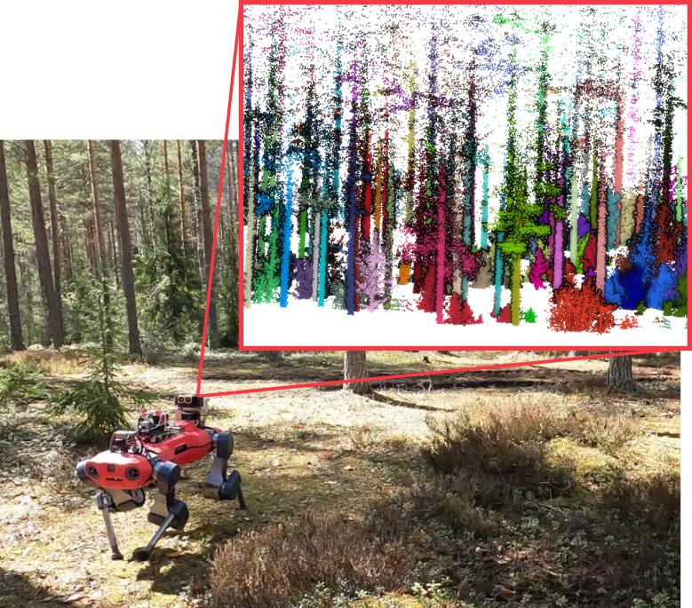

<div align="center">
  <h1>🌲 Forest Inventory Pipeline</h1>
  <p>
    Tree instance segmentation and trait estimation from LiDAR data collected by mobile robots
  </p>
  
</div>

---

## 📌 Overview
This project implements a pipeline that takes raw LiDAR point clouds from forest environments and automatically:
- Removes the ground and low vegetation  
- Segments individual trees  
- Estimates the **Diameter at Breast Height (DBH)** for each tree  

The code is written in Python, tested on **Ubuntu 22.04 LTS** with **Python 3.10**, and can be run either natively or inside a Docker container.  

System dependencies:

- libegl1 libgl1 libgomp1 (required by Open3D)

```bash
sudo apt install libegl1 libgl1 libgomp1
```

- build-essential (Gives g++ make libc among others)

```bash
sudo apt install build-essential
```

CMake is not needed to build the package. This is handled by the python build system.

### forest_inventory_pipeline

After you clone the repository, installing it is a simple

```bash
pip install -v .
```

or

```bash
make [install] # install is the default target
```

### Docker

Please check the `docker/` folder.
A simple Dockerfile is provided that sets up the project in a base Ubuntu 22.04 image.
A `compose.yaml` file is provided for convenience as well.
This also has services to run some different experiments on data.

You can run a container with `forest_inventory_pipeline` setup by running the following from inside `docker/`

```bash
docker compose run fip
```

## Usage

The CLI entrypoint `fip` covers most of the relevant information needed to use the package.
Additionally, parameters are described and their default values are given in corresponding files under `config/`.

```bash
fip --help
fip instance --help
fip dbh --help
```

Example runs:

```bash
# relevant output of the following is an instance_segmented_cloud.ply
fip instance /data/input_cloud.ply --output /output -c config/instance.yaml
```

In case some stages have been run earlier, corresponding skip flags can be used.

```bash
# relevant output of the following is cylinders.pickle and tree_dbh.csv
fip dbh /data/input_cloud.ply --output output -c config/dbh.yaml --skip_gs --skip_norm --skip_cluster
```

If the `--output` flag is specified, only then do results get written to disk.

### Example Experiments

To test and use the approach, you can use the provided Docker image and some simple experiment scripts in `scripts/evaluation`.
These scripts need the data in a slightly specific format detailed further in their documentation (use `--help` when running the cli).

Please see the [DigiForests dataset](https://www.ipb.uni-bonn.de/data/digiforest-dataset/) for some forestry data you can run the approach on.

To run an instance segmentation experiment, `cd` into the `docker/` folder, modify the `compose.yaml` file to have the appropriate data mount, and then run:

```bash
docker compose run fip_instance
```

The results will get printed to the console.

To run a DBH estimation experiment, `cd` into the `docker/` folder and then run:

```bash
docker compose run fip_dbh
```
